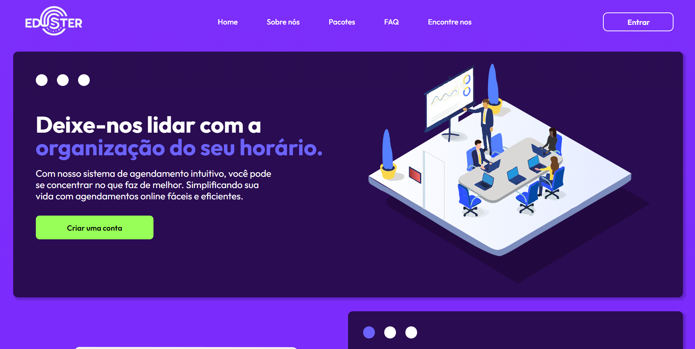

# Eduster : sitema de agendamento e gerenciamento de salas

A **Eduster** é uma plataforma de gerenciamento e agendamentos de salas. Trata-se de um projeto que está sendo desenvolvido na materia de WebDesing na minha faculdade com o objetivo de nos ensinar sobre como funciona as etápas de desenvolvimento de um projeto real como também utilizar tecnologias e conceitos vistos em sala. Desenvolvido com JavaScript, HTML e CSS, além de algumas bibliotecas extras.

## 📈 Status de Desenvolvimento

- [x] Criação das páginas inicias.
- [x] Criação do responsivo das páginas inicias.
- [x] Criação das págimas de login e registro.
- [x] Criação do responsivo das págimas de login e registro.
- [ ] Criação da verificação e autenticação das págimas de login e registro.
- [ ] Criação da página principal do projeto.
- [ ] Criação do responsivo da página principal.
- [x] Criação dos modais para agendar as salas.
- [x] Responsivo dos modais para agendar as salas.
- [x] Criação dos modais para confirmar os agendamentos e modais de dúvidas.
- [ ] Criação do modal para listar salas ocupadas e vázias.
- [x] Responsivo do modal para listar salas.
- [ ] Atualizar o responsivo da página dos pacotes. 

<a href='#top'>🔼 Voltar ao topo</a>

---
